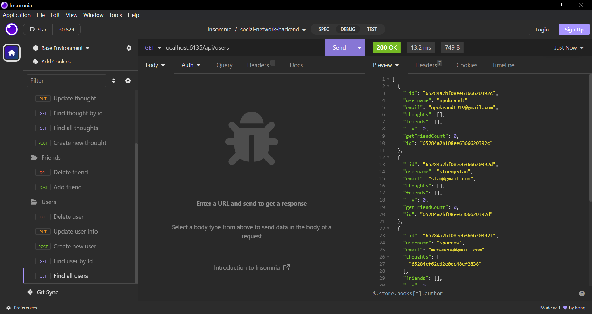

# Social Network Backend 

## Description

Welcome to the Social Network Backend! It is a backend setup to configure a collection of users and their friends to share their thoughts and react to each other's thoughts. It is an express server that uses MongoDB for storage.

## Usage

Since there is no front end, the server must be interacted with via Insomnia or a similar GUI.

There are four elements in play with routes to access and modify them.

User: The get method simply gets all the users in the collection. There is a second get method that takes the id of one of the users (the id being a 24-character string of hexadecimal characters) and returns that user. The post method adds a new user, and requires the user's username and email. Along with those the user has an array that contains the ids of all the thoughts they've posted, an array of their friends (which are all other user ids) and a virtual that returns the number of friends they have. The put method gets a user by id and allows for username and email of that user to be modified. Finally, the delete method get a user id and deletes that user.

Friend:
The friends are all just other users, referenced by their ids. Each route first gets the user in question, then the id of the user's friend. If the friend is being added to the list, the user adds their id to the friend array. If the friend is being deleted, their id is removed from the friend list.

Thought:
Thoughts have all the same routes as users do. The post route adds a thought, composed of the thought text (limited to 280 characters) and the username of the user who posted the thought. In addition the date posted is added and a virtual showing the number of reactions to the post, and the thought id to the user's thoughts array. The get route gets all thoughts; the get with an id gets the thought which has that id. The put route allows the user to change the text (but not the username). The delete deletes the thought and removes the thought's id from the user's thought array.

Reaction:
As friends are reliant on a user, so are reactions to thoughts. A reaction is a subdocument of a thought, and is composed of the reaction message (also limited to 280 characters) and the username of the user who posted the reaction. The date added is added as well. This is all added to the thought's reaction array. If a thought is deleted, it is removed from the reaction array.

Below shows Insomnia with all the routes open; the one being used is the "get all users" route

## Link

See the video linked below for how each of these routes works:
<!-- link to the video walkthrough -->

## Credits

The email regex used in the user model comes from the previous assignment. I got help from stackoverflow and the mongoose docs for a lot of the work, especially with adding and taking data from the subdocument, but beyond that the code is my own.